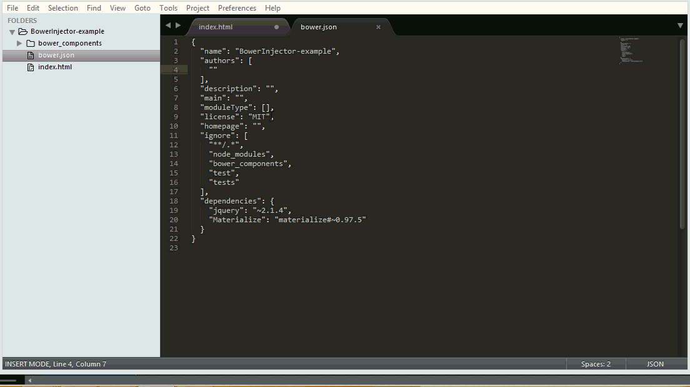

# sublime3-bower-Injector
A sublime text 3 plugin that inject all bower dependencies
in the **index.html** page of the current project

## Screenshot


## Dependencies
you should have python 3 already installed on your machine and Sublime text 3.

## Installation
In order to install this plugin you have two options,
the manual option and the package control one(the easy choice)

### Manually
You can easily install this plugin manually, simply download the zip file and extract it to sublime text   **Packages** folder

### Package Control
Installation through [package control](http://wbond.net/sublime_packages/package_control) is recommended. It will handle updating your packages as they become available. To install, do the following.

* In the Command Palette, enter `Package Control: Install Package`
* Search for `BowerInjector`

## How does it work ?
Now the plugin is installed and ready to be used.
Let's say that you have a project organized like the following:

```
myProject/
├── otherStuff/
├── bower_components/
│   ├── jquery/
│   ├── bootstrap/
│   └── ...
│
├── bower.json  
└── index.html
```

simply add **bower:css** or **bower:js** to **index.html** depending on what you want to load, generally we want to load them both so we end up with something like that :

```html
<html>
  <head>
      <!-- load css files -->

      <!-- bower:css -->
      <!-- endbower -->

  </head>

  <body>
    <!-- body content goes here -->
    <!-- load js files -->

    <!-- bower:js -->
    <!-- endbower -->

  </body>
</html>
```

**Bonus :**
Now you can use ``bower_css`` or ``bower_css`` then hit <kbd>tab</kbd>  to complete the snippet automatically rather than completing it manually  

### Run the plugin
You have two options :
* Hit <kbd>ctrl</kbd> + <kbd>y</kbd>   to execute the plugin( you can change the key )
* Fire up the command palette <kbd>ctrl</kbd> + <kbd>shift</kbd> + <kbd>p</kbd> and type ``bower injector`` and press <kbd>enter</kbd>

### TODO
* Inject dependencies in the right order (for example bootstrap depends on jquery ).
* Possibility to pull in minfied versions(if exist).
* Possibility to inject just specific package.
